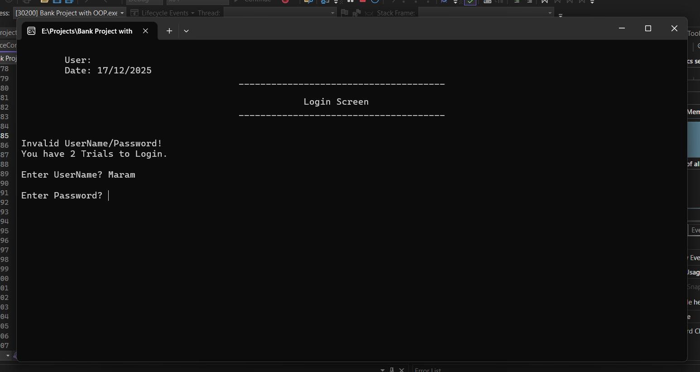
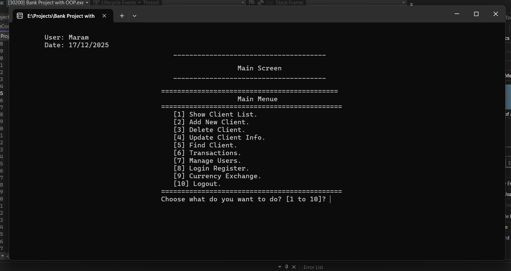
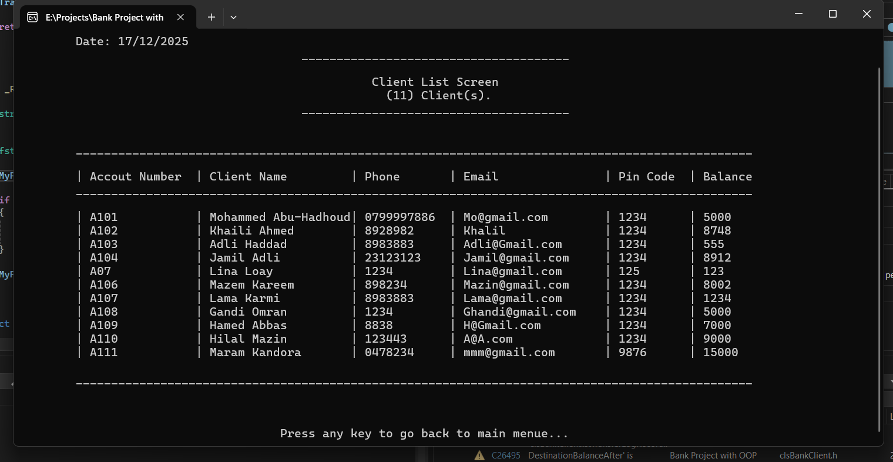
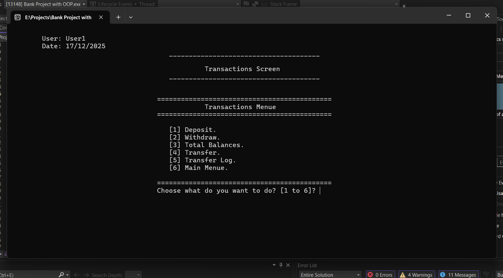
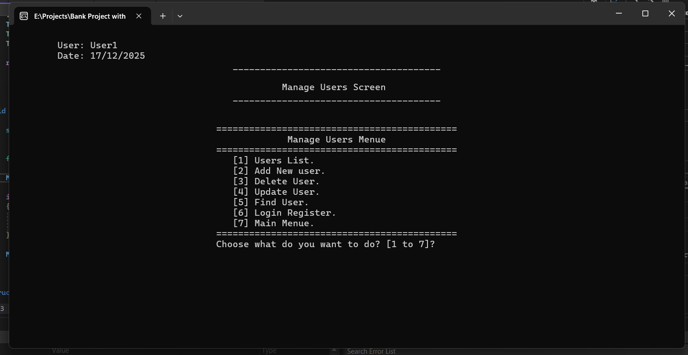
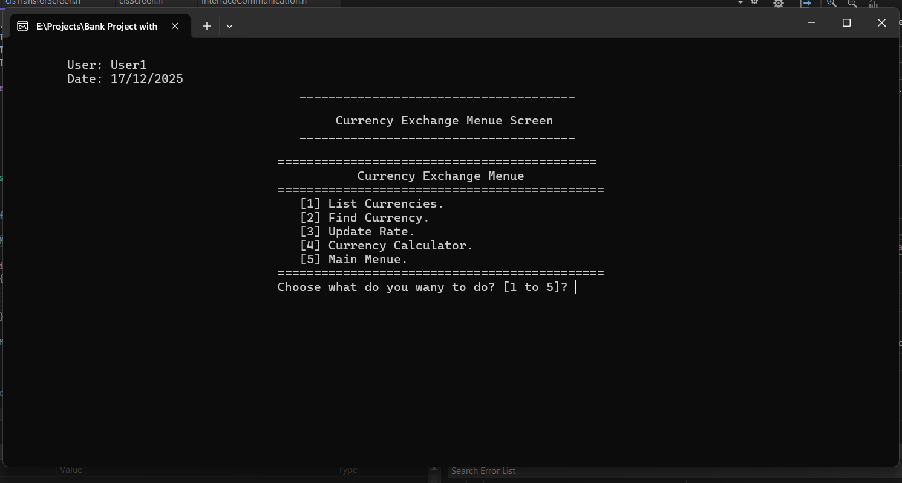

# Bank Management System (C++)

A **console-based Bank Management System** developed using **C++** and **Object-Oriented Programming (OOP)** principles. The project simulates basic banking operations such as client management, transactions, user authentication, and currency exchange through a text-based interface.

---

##  Purpose

This project was built as part of my learning journey to strengthen understanding of **C++**, **OOP concepts**, and building structured console applications.

## Features

### Authentication & Security

* User login system with limited login attempts
* Login register to track user access
* Role-based access (users management)

### Client Management

* Show client list
* Add new client
* Update client information
* Delete client
* Find client by account number

### Transactions

* Deposit
* Withdraw
* Transfer between accounts
* View total balances
* Transfer log history

### Currency Exchange

* Currency conversion feature

### Interface

* Clear, menu-driven console UI
* Organized screens (Login, Main Menu, Transactions)

---

## Technologies Used

* **Programming Language:** C++
* **Paradigm:** Object-Oriented Programming (OOP)
* **IDE:** Visual Studio
* **Application Type:** Console Application
* **Data Storage:** Text files (used as a simple database for storing users, clients, and TrannsferLog)

---

## OOP Concepts Applied

* Classes & Objects
* Encapsulation
* Separation of concerns
* Reusable and modular code structure

##  Screenshots

### Login Screen

### Main Menu

### Clients List

### Transactions Menu

### User Management Menu

### Currency Exchange Menu

